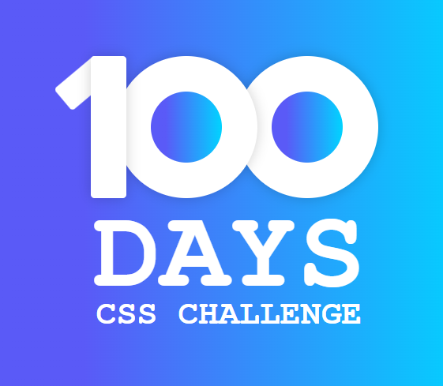

# 100 Días con CSS: Un Mini Proyecto por Día

## ¡Bienvenido a mi desafío de 100 Días con CSS! 🚀

En este repositorio, me propongo mejorar mis habilidades en CSS creando un mini proyecto cada día durante 100 días consecutivos. Cada proyecto está diseñado para enfocarse en diferentes aspectos y técnicas de CSS, desde lo más básico hasta conceptos más avanzados.

## Objetivos del Desafío

- Aprender y Dominar CSS: Mejorar mi comprensión y aplicación de CSS a través de la práctica diaria.

- Documentar el Proceso: Registrar mi progreso y compartir mis aprendizajes con la comunidad.

- Inspirar a Otros: Motivar a otros a unirse al desafío y mejorar sus propias habilidades en CSS.

## Estructura del Repositorio

Cada proyecto diario se almacenará en una carpeta separada.

## Contribuir

Si quieres contribuir al desafío, ¡serás bienvenido! Puedes:

- Proponer nuevas ideas para proyectos.

- Reportar problemas o errores.

- Mejorar proyectos existentes con nuevas técnicas de CSS.

## Licencia

Este proyecto está bajo la Licencia MIT - ver el archivo LICENSE para más detalles.
