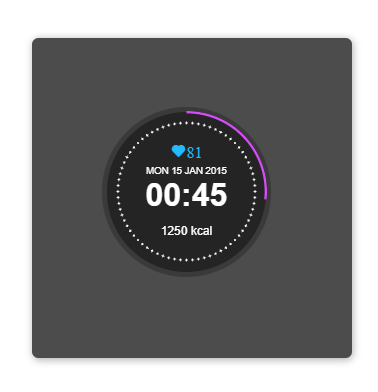

# Reloj Moderno

Este proyecto es una demostración de un reloj moderno utilizando HTML, CSS y JavaScript. El diseño incluye un círculo con puntos y una animación de spinner, así como información adicional como la fecha, la hora, el ritmo cardíaco y las calorías quemadas.

## Carturas de pantalla

## Características

- Diseño Moderno**: Un reloj con un diseño moderno y elegante.
- Animación de Spinner**: Un círculo animado que simula un spinner.
- Información Adicional**: Muestra la fecha, la hora, el ritmo cardíaco y las calorías quemadas.

## Tecnologías Utilizadas

- HTML: Estructura del contenido.
- CSS: Estilos y animaciones.
- JavaScript: Lógica y funcionalidad.

## Estructura del Proyecto

- index.html: Contiene la estructura HTML del reloj.
- styles.css: Contiene los estilos y animaciones CSS.
- script.js: Contiene la lógica y funcionalidad JavaScript (si es necesario).
