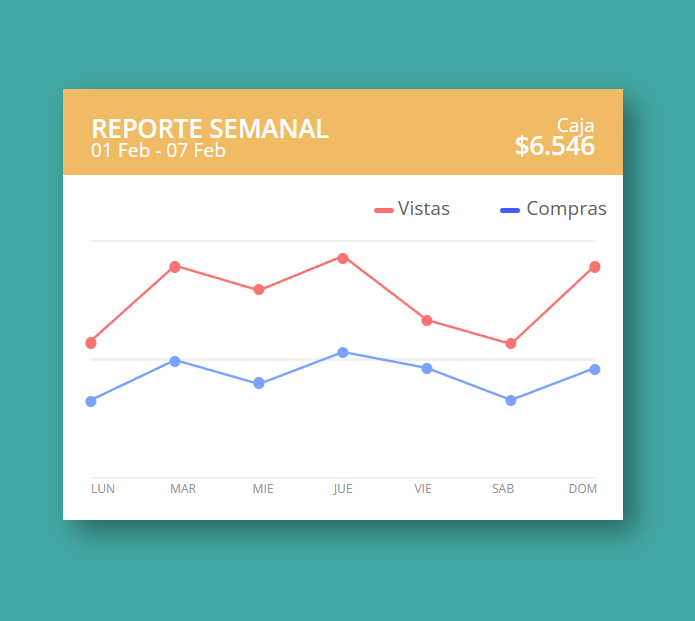

# Proyecto de Reporte Semanal

Este proyecto demuestra el uso de HTML y CSS para crear un reporte semanal visualmente atractivo. El reporte incluye un gráfico con líneas y puntos interactivos que muestran información sobre ventas y compras a lo largo de una semana.

## Características

- Diseño responsivo utilizando `flexbox` y `grid`.
- Uso de `box-shadow` para agregar sombras a los elementos.
- Animaciones y transiciones CSS para mejorar la experiencia del usuario.
- Gráfico interactivo con líneas y puntos que muestran tooltips al pasar el ratón.

## Tecnologías Utilizadas

- HTML
- CSS

# Pasos Seguidos

## Estructura HTML:

- Se creó una estructura básica de HTML con un contenedor principal `.container` que incluye:
  - Un encabezado `.header` con el título del reporte, la fecha, el tipo y el valor.
  - Una sección de parámetros `.parameter` que muestra las categorías de datos (vistas y compras).
  - Un gráfico `.grafico` con líneas y puntos interactivos.
  - Una sección de días `.days` que muestra los días de la semana.

## Estilos CSS:

- Se aplicaron estilos generales para el cuerpo y el contenedor.
- Se definieron estilos específicos para el encabezado, los parámetros, el gráfico y los días.
- Se utilizaron `box-shadow` para agregar sombras a los elementos y `clip-path` para definir formas personalizadas.
- Se añadieron transiciones y animaciones CSS para mostrar tooltips al pasar el ratón sobre los puntos del gráfico.

## Gráfico Interactivo:

- Se utilizó SVG para dibujar las líneas del gráfico.
- Se añadieron puntos interactivos con tooltips que muestran información al pasar el ratón.
- Se definieron dos conjuntos de datos (rojo y azul) para representar diferentes categorías (vistas y compras).
