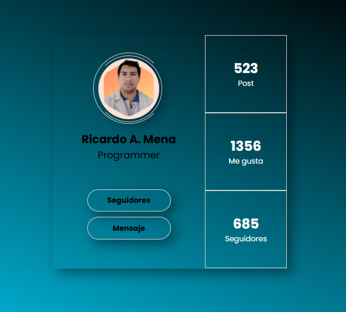

# Proyecto de Tarjeta de Perfil

Este proyecto demuestra el uso de HTML y CSS para crear una tarjeta de perfil visualmente atractiva. La tarjeta incluye una imagen de perfil, nombre, ocupación, enlaces de seguidores y mensaje, y estadísticas de publicaciones, me gusta y seguidores.

## Características

- Diseño responsivo utilizando `flexbox` y `grid`.
- Uso de `box-shadow` para agregar sombras a los elementos.
- Animaciones y transiciones CSS para mejorar la experiencia del usuario.
- Imagen de perfil con efecto de rotación al pasar el ratón.

## Tecnologías Utilizadas

- HTML
- CSS

# Pasos Seguidos

## Estructura HTML:

- Se creó una estructura básica de HTML con un contenedor principal `.container` que incluye:
  - Una sección izquierda `.left` con la imagen de perfil, nombre, ocupación y enlaces.
  - Una sección derecha `.right` con estadísticas de publicaciones, me gusta y seguidores.

## Estilos CSS:

- Se aplicaron estilos generales para el cuerpo y el contenedor.
- Se definieron estilos específicos para la imagen de perfil, nombre, ocupación, enlaces y estadísticas.
- Se utilizaron `box-shadow` para agregar sombras a los elementos y `clip-path` para definir formas personalizadas.
- Se añadieron transiciones y animaciones CSS para mostrar efectos al pasar el ratón sobre la imagen de perfil y los enlaces.
