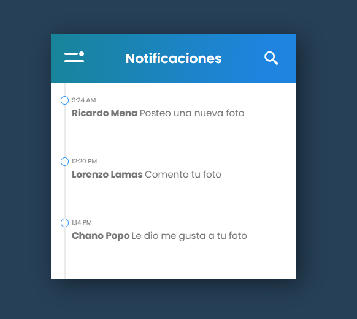
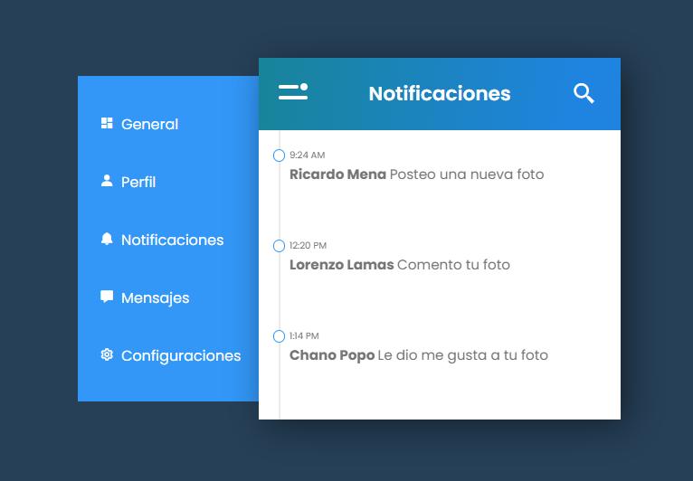

# Proyecto de Notificaciones

Este proyecto demuestra el uso de HTML, CSS y JavaScript para crear una interfaz de notificaciones interactiva. La interfaz incluye un menú desplegable, un campo de búsqueda y una lista de notificaciones animadas.

## Características

- Diseño responsivo utilizando `flexbox` y `grid`.
- Uso de `box-shadow` para agregar sombras a los elementos.
- Animaciones y transiciones CSS para mejorar la experiencia del usuario.
- Campo de búsqueda interactivo.
- Menú desplegable con animaciones.

## Tecnologías Utilizadas

- HTML
- CSS
- JavaScript

# Pasos Seguidos

## Estructura HTML:

- Se creó una estructura básica de HTML con un contenedor principal `.container` que incluye:
  - Una sección `.note` con el encabezado, campo de búsqueda y notificaciones.
  - Una sección `.lista` con el menú desplegable.

## Estilos CSS:

- Se aplicaron estilos generales para el cuerpo y el contenedor.
- Se definieron estilos específicos para el encabezado, campo de búsqueda, notificaciones y menú.
- Se utilizaron `box-shadow` para agregar sombras a los elementos y `transition` para animaciones suaves.
- Se añadieron transiciones y animaciones CSS para mostrar y ocultar el campo de búsqueda y el menú desplegable.

## Lógica JavaScript:

- Se definió la lógica para alternar la visibilidad del campo de búsqueda y el menú desplegable utilizando `classList.toggle`.
- Se añadieron event listeners a los iconos de búsqueda y menú para manejar los clics del usuario.
