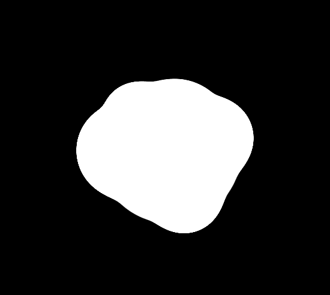

# Proyecto de Círculo Líquido

Este proyecto demuestra el uso de HTML y CSS para crear un efecto visual de círculos líquidos en movimiento. La animación utiliza transformaciones y filtros CSS para lograr un efecto fluido y atractivo.

## Características

- Diseño responsivo utilizando `flexbox`.
- Uso de `box-shadow` y `filter` para agregar efectos visuales.
- Animaciones y transiciones CSS para crear un efecto de rotación continua.
- Efecto de desenfoque aplicado a los elementos.

## Tecnologías Utilizadas

- HTML
- CSS

# Pasos Seguidos

## Estructura HTML:

- Se creó una estructura básica de HTML con un contenedor principal `.container` que incluye:
  - Un elemento `.center` que contiene varios elementos `.ball` y `.ball-x` para crear los círculos líquidos.

## Estilos CSS:

- Se aplicaron estilos generales para el cuerpo y el contenedor.
- Se definieron estilos específicos para los elementos `.ball` y `.ball-x`.
- Se utilizaron `filter` para aplicar efectos de desenfoque y contraste.
- Se añadieron transiciones y animaciones CSS para crear el efecto de rotación continua.

## Animaciones CSS:

- Se definió una animación `rotate` utilizando `@keyframes` para rotar los elementos de 0 grados a 360 grados.
- Se aplicaron diferentes duraciones y retrasos a las animaciones para crear un efecto visual dinámico.
