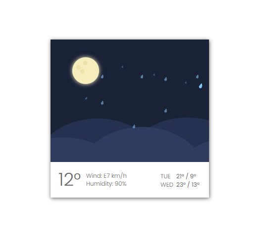

# Proyecto de Lluvia Nocturna

Este proyecto demuestra el uso de HTML y CSS para crear una animación de una noche lluviosa con una luna y colinas. La animación incluye gotas de lluvia que caen y una luna con cráteres.

## Características

- Animación de gotas de lluvia utilizando `@keyframes`.
- Uso de `box-shadow` para agregar sombras a los elementos.
- Diseño responsivo utilizando `position`.
- Efecto de subida de la luna al cargar la página.

## Tecnologías Utilizadas

- HTML
- CSS

## Pasos Seguidos

### Estructura HTML

- Se creó una estructura básica de HTML con un contenedor principal `.container` que incluye:
  - Un elemento `.moon` que contiene los cráteres de la luna.
  - Varios elementos `.hill-bg` y `.hill-bf` para crear las colinas.
  - Un elemento `.front` que contiene la información del clima y las gotas de lluvia.

### Estilos CSS

- Se aplicaron estilos generales para el cuerpo y el contenedor.
- Se definieron estilos específicos para la luna, los cráteres, las colinas y las gotas de lluvia.
- Se utilizaron `box-shadow` para agregar sombras a los elementos y `@keyframes` para las animaciones.

### Animaciones CSS

- Se definió una animación `rise` utilizando `@keyframes` para subir la luna al cargar la página.
- Se definió una animación `drop` utilizando `@keyframes` para las gotas de lluvia.
